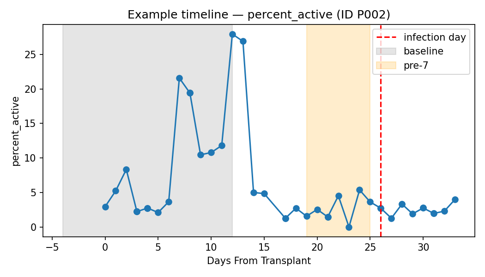
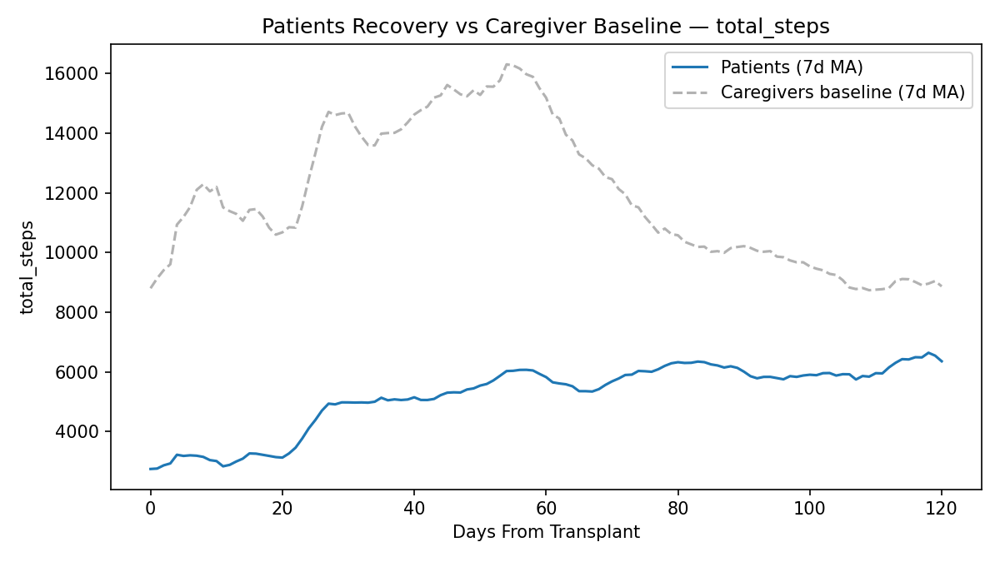
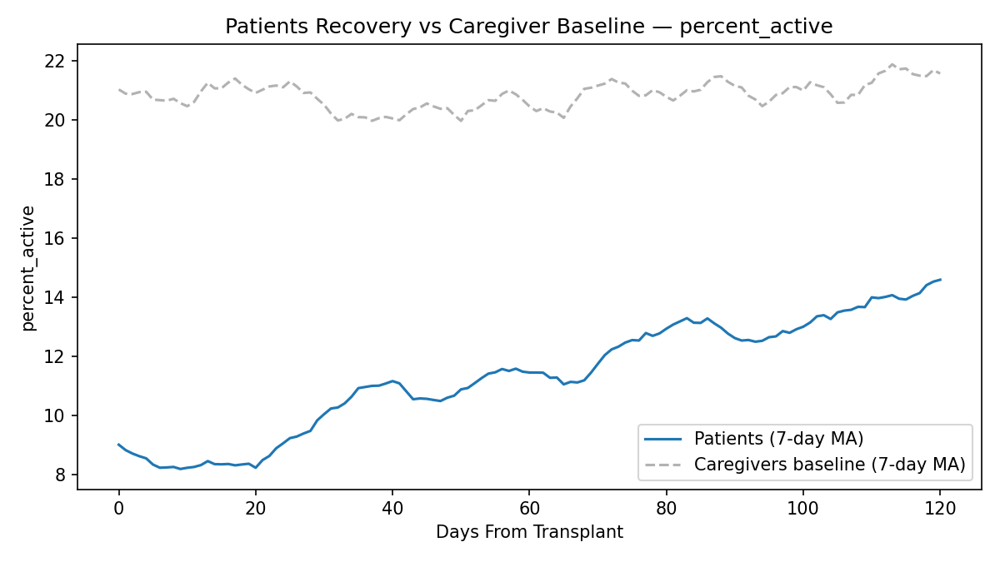
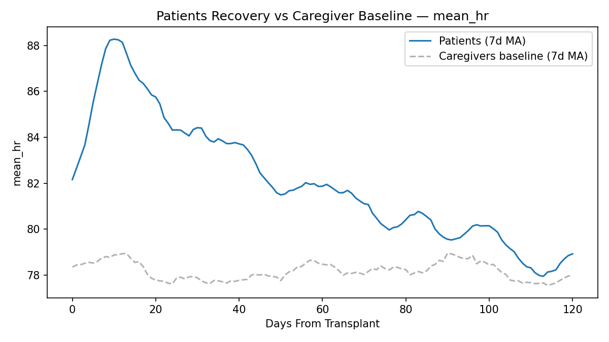
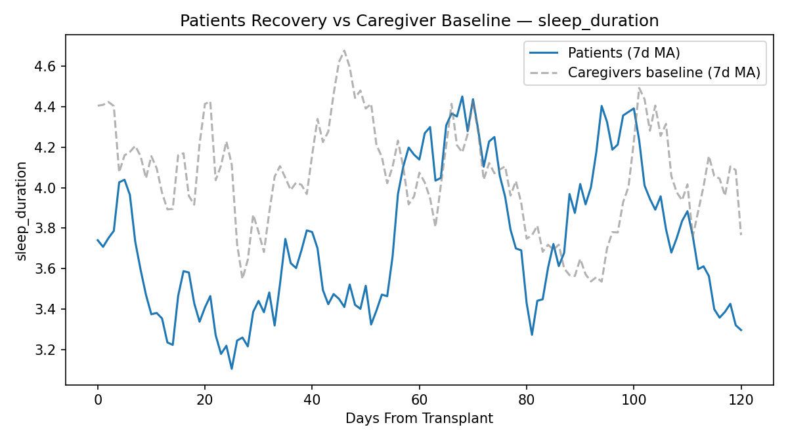
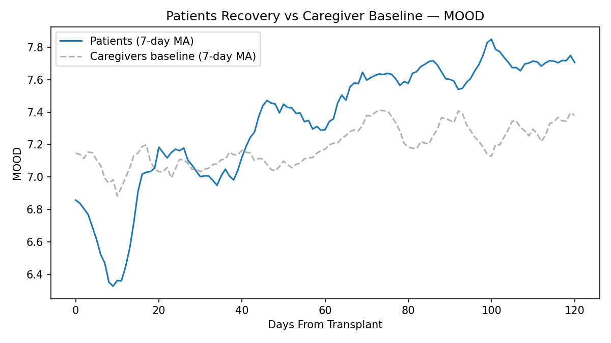
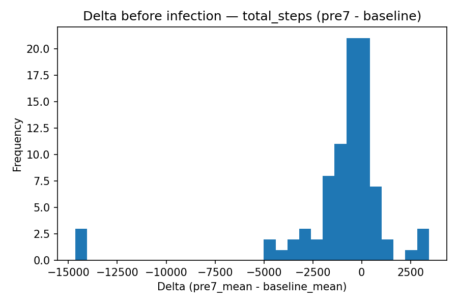
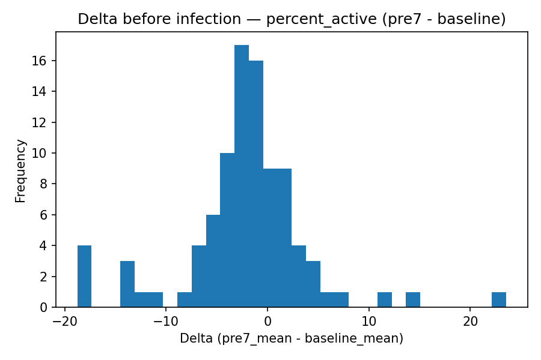
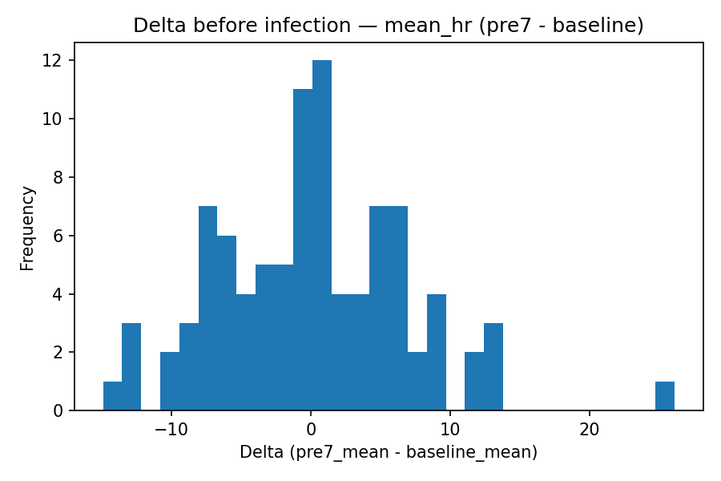
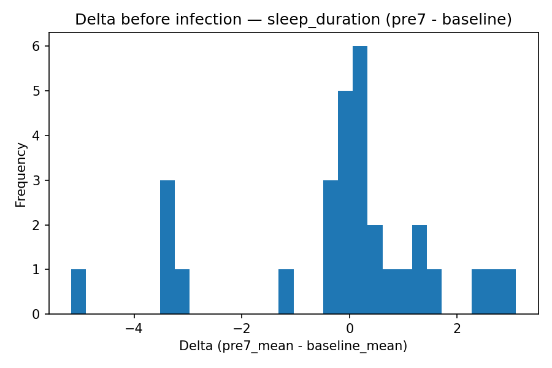

# Digital Biomarkers to Model Recovery & Predict Outcomes in HCT Patients

> Can passively collected wearables data (steps, sleep, heart rate, mood) tell us how a patient is recovering after a **hematopoietic cell transplant (HCT)** — and warn us *before* an adverse event like an infection or readmission?
>
> This project links daily behavioral/physiological signals to clinical outcomes to (1) model recovery trajectories and (2) detect early-warning signal drops ahead of infection events.

<p align="center">
  
</p>

<p align="center">
  <sub><b>Example early-warning timeline.</b> A single participant's daily <code>percent_active</code> around an infection event — activity visibly declines in the pre-event window before the clinical diagnosis.</sub>
</p>

---

## 📌 TL;DR — Key Findings

> _Replace the bracketed values with your actual results from `early_warning_outputs/infection_early_warning_overview.csv`._

- **Activity drops before infection.** In the pre-event window (−7 to −1 days), daily `total_steps` / `percent_active` fell by **[X%]** on average relative to each patient's −30 to −14 baseline.
- **Heart rate trends up.** `mean_hr` rose by **[X bpm / X%]** in the same pre-event window — consistent with physiological stress preceding clinical infection.
- **Sleep was [the most / least] sensitive signal**, changing by **[X]**.
- **Recovery is gradual.** Patients took roughly **[N] days post-transplant** to return toward caregiver-like activity and sleep levels.

**So what?** Activity and HR derived from a consumer wearable show measurable, directional change *days before* a documented infection — suggesting passive monitoring could surface a clinical "heads-up" window for earlier intervention.

---

## ⚙️ Quick start

```bash
# 1) Create and activate a virtual environment (Python ≥3.10)
python -m venv .venv && source .venv/bin/activate   # (Windows: .venv\Scripts\activate)

# 2) Install dependencies
pip install pandas numpy matplotlib scipy

# 3) Place the data CSVs in the repo root (already included):
#   - physiological_dataset_day.csv
#   - psych_behavioral_dataset_day.csv
#   - events_infections.csv
#   - events_outcomes.csv

# 4) Run the pipeline
python build_two_datasets_simple.py
python check_heads_and_rationale.py
python recovery_patients_with_caregiver_baseline.py   # → writes plots to Trajectory/
python early_warning_signs.py                         # → writes plots/tables to early_warning_outputs/
```

> **Tip:** All scripts read CSVs from the project root and write outputs to local subfolders (`Trajectory/`, `early_warning_outputs/`).

---

## 🧬 Analysis 1 — Recovery vs. Caregiver Baseline

**Question:** *How quickly do patients return to "normal" after transplant?*

Each patient's daily metrics are compared against a matched **caregiver baseline** (a healthy reference for the same household/period). The gap between the two lines is a proxy for how far the patient still is from their recovered state — and how fast it closes.

<table>
  <tr>
    <td align="center"><br><sub>Total steps</sub></td>
    <td align="center"><br><sub>Percent active</sub></td>
  </tr>
  <tr>
    <td align="center"><br><sub>Mean heart rate</sub></td>
    <td align="center"><br><sub>Sleep duration</sub></td>
  </tr>
  <tr>
    <td align="center" colspan="2"><br><sub>Self-reported mood (MOOD)</sub></td>
  </tr>
</table>

**Reading the charts:** The x-axis is `DaysFromTransplant`; each panel overlays the patient trajectory against the caregiver reference. A widening gap right after transplant that narrows over time = recovery in progress.

---

## 🚨 Analysis 2 — Early Warning Before Infection

**Question:** *Do daily steps, HR, and sleep change in the days leading up to an infection?*

For every infection event, the script compares two windows per participant:

| Window | Range (relative to event) | Purpose |
|---|---|---|
| **Baseline** | −30 to −14 days | The patient's "stable" reference |
| **Pre-event** | −7 to −1 days | The suspected warning window |

The histograms below show the **distribution of change (Δ)** from baseline → pre-event across all events. A distribution shifted away from zero means the metric reliably moves *before* infection.

<table>
  <tr>
    <td align="center"><br><sub>Δ Total steps</sub></td>
    <td align="center"><br><sub>Δ Percent active</sub></td>
  </tr>
  <tr>
    <td align="center"><br><sub>Δ Mean heart rate</sub></td>
    <td align="center"><br><sub>Δ Sleep duration</sub></td>
  </tr>
</table>

A per-event summary table is exported to **[`early_warning_outputs/infection_early_warning_overview.csv`](early_warning_outputs/infection_early_warning_overview.csv)**.

> Window ranges and metrics are configurable near the top of `early_warning_signs.py` (see the `Windows` dataclass and `METRICS`).

---

## 🗂️ Repository layout

```
.
├── build_two_datasets_simple.py              # Build/clean derived daily datasets for downstream scripts
├── check_heads_and_rationale.py              # Sanity checks on headers; prints rationale & column expectations
├── recovery_patients_with_caregiver_baseline.py   # Analysis 1: recovery vs. caregiver baseline → Trajectory/
├── early_warning_signs.py                    # Analysis 2: event-centered windows around infections → early_warning_outputs/
├── physiological_dataset_day.csv             # Daily wearables/physiology (steps, HR, sleep, etc.)
├── psych_behavioral_dataset_day.csv          # Daily mood/behavioral measures (e.g., MOOD)
├── events_infections.csv                     # Event log for infection episodes
├── events_outcomes.csv                       # Event log for other outcomes (e.g., readmission)
├── Trajectory/                               # Recovery-trajectory figures (Analysis 1)
├── early_warning_outputs/                    # Early-warning figures & summary table (Analysis 2)
├── Initial_data/  ·  data_unused/            # Staging / archival inputs not used in v1
├── Rationale.txt                             # Notes on design decisions & column checks
└── .gitignore
```

## 📚 Data fields (high-level)

* **physiological_dataset_day.csv** — `STUDY_PRTCPT_ID`, `DaysFromTransplant`, daily aggregates such as `total_steps`, `sleep_duration`, `mean_hr`, plus optional derivatives like `percent_active` and `sleep_efficiency` (when `ASLEEP_MIN` and `INBED_VALUE` exist).
* **psych_behavioral_dataset_day.csv** — `STUDY_PRTCPT_ID`, `DaysFromTransplant`, and psych/behavioral fields such as `MOOD`.
* **events_infections.csv / events_outcomes.csv** — event-level rows keyed by participant + event date, used to align analysis windows.

## 🧰 Dependencies

* Python ≥ 3.10
* `pandas`, `numpy`, `matplotlib`, `scipy`

## 🗜️ Reproducibility notes

* All scripts expect the four CSVs in the project root, UTF-8 encoded, with consistent `STUDY_PRTCPT_ID` and `DaysFromTransplant` keys.
* Minor naming differences across sources (e.g., `Sara` vs. `Sarah`) are **not** reconciled here; matching is done on the keys present in the daily tables.
* Missing optional columns are skipped gracefully so the pipeline still runs.

## 🧭 Roadmap

* `argparse` CLIs (e.g., `--baseline -30 -14 --pre -7 -1 --metrics steps,hr,sleep`).
* Unit tests for feature derivation and windowing.
* EDA + model-training notebooks.
* A lightweight predictive model (e.g., logistic regression) for event prediction.

## 🔒 Ethics & privacy

This project uses **de-identified, IRB-approved** datasets. When extending it, ensure all data handling respects HIPAA/PHI rules and your local IRB guidance.

## 📝 Citation

> Su, D. J. (2025). *Digital Biomarkers to Model Recovery & Predict Outcomes in HCT Patients* (Version 1.0) [Computer software]. GitHub: DonaldJasper0621.

---

**Maintainer:** Donald Jasper Su  ·  Issues and PRs welcome!
